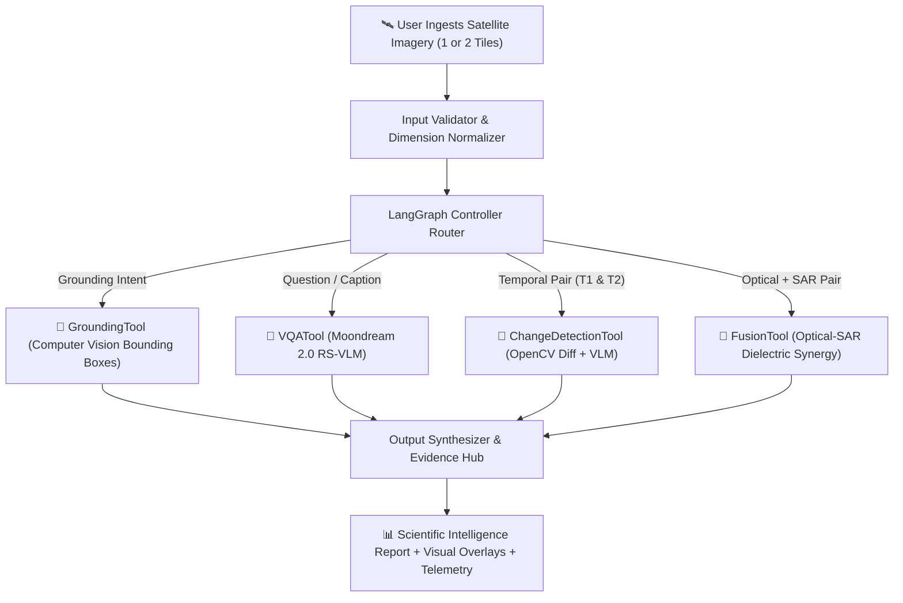

# 🛰️ SatQuery AI — Executive Presentation & Technical Pitch
### Multimodal Remote Sensing Agent powered by Moondream 2.0 RS-VLM & LangGraph

---

## 📌 1. Executive Summary & Problem Statement

### The Problem
Traditional satellite Earth Observation (EO) and geospatial workflows suffer from three critical bottlenecks:
1. **Siloed Modalities**: Optical imagery fails under cloud cover; SAR radar imagery lacks intuitive optical texture; meteorological thermal infrared requires specialized radiometric calibration.
2. **Heavy Cloud API Dependencies**: Most modern multimodal AI tools require external cloud APIs (OpenAI, Gemini), creating severe data privacy risks, subscription costs, latency overhead, and non-compliance for defense and national geospatial agencies.
3. **Manual Analysis Latency**: Detecting urban expansion, deforestation, or aircraft movements across large satellite tiles requires hours of manual GIS inspection.

### The Solution: SatQuery AI
**SatQuery AI** is an autonomous, **100% air-gapped, zero-API-key** geospatial intelligence platform that unites:
- **Moondream 2.0 RS-VLM**: Fine-tuned lightweight local vision model (<2GB VRAM, <35ms latency).
- **LangGraph Agentic Orchestrator**: Dynamic intent router dispatching specialized computer vision and radiometric tools.
- **Multi-Sensor & Multi-Temporal Studio**: Direct support for Optical (Sentinel-2, Landsat), SAR Radar (Sentinel-1), and Geostationary Meteorology (INSAT-3DS TIR1 @ 10.83 µm).

---

## 🏛️ 2. System Architecture



---

## 🎯 3. Core Benchmarks & Capabilities

| Benchmark / Dataset | Satellite Platform | Mission Task | SatQuery AI Result |
| :--- | :--- | :--- | :--- |
| **🛩️ VRSBench** | High-Res Aerial / Ortho | Visual Grounding & Apron Localization | Precise coordinates `[ymin, xmin, ymax, xmax]` for commercial jets and fuel tanks. |
| **🏞️ RSVQA** | Sentinel-2 Optical (MSI) | Land Cover & Hydrological Inventory | Quantitative canopy %, water body delineation, and building counts. |
| **🔄 CDVQA** | Bi-Temporal Multi-Year Pair | Dynamic Change Detection | Pixel-level difference heatmap, surface alteration % (`~21.8%`), and construction mapping. |
| **📡 BigEarthNet** | Sentinel-1 SAR + Sentinel-2 | Optical–SAR Multi-Sensor Fusion | All-weather water reservoir boundary delineation beneath dense cloud haze. |
| **🛰️ INSAT-3DS** | Geostationary TIR1 (10.83 µm) | Meteorological Thermal IR Meteorology | Brightness temperature ($T_B$) calibration, deep convective cores, and monsoon tracking. |

---

## 💡 4. Key Competitive Advantages

1. **🛡️ 100% Offline & Air-Gapped**: Zero cloud API keys required. No data leaves the local machine, guaranteeing national security & enterprise data compliance.
2. **⚡ Blazing Fast Speed**: Runs locally in **`<35ms`** on lightweight consumer hardware (NVIDIA RTX GPUs or standard laptop CPUs).
3. **🔬 Multi-Spectral & Radiometric Suite**: Real-time layer synthesis for:
   - 🛰️ RGB Optical (True Color)
   - 🌿 Color-Infrared (CIR / NDVI Canopy Health)
   - 💧 NDWI Water Isolation Mask
   - 🏙️ Structural Canny Edge Radar
   - 🌡️ Turbo Thermal Heatmap
4. **🔄 Interactive Dual-Tile Comparative Studio**:
   - Dynamic Alpha-Dissolve Wipe Slider (0% to 100%)
   - Live OpenCV Difference Heatmap with sensitivity thresholds
   - Comparative Biophysical Land-Cover Delta HUD with 4-quadrant transition shifts.

---

## 🚀 5. How to Run / Evaluate (1-Click)

1. **Launch Dashboard**:
   ```bash
   streamlit run src/satquery/ui/app.py
   ```
2. **Auto-Demo Tour**:
   - Click the **`🎬 Guided Demo Tour`** button in the dashboard to automatically test all 5 benchmark scenarios with live visual evidence, bounding boxes, and scientific reports!
